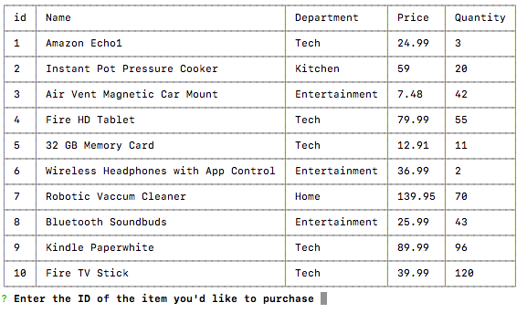
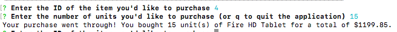
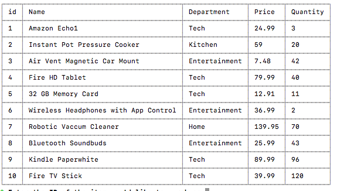
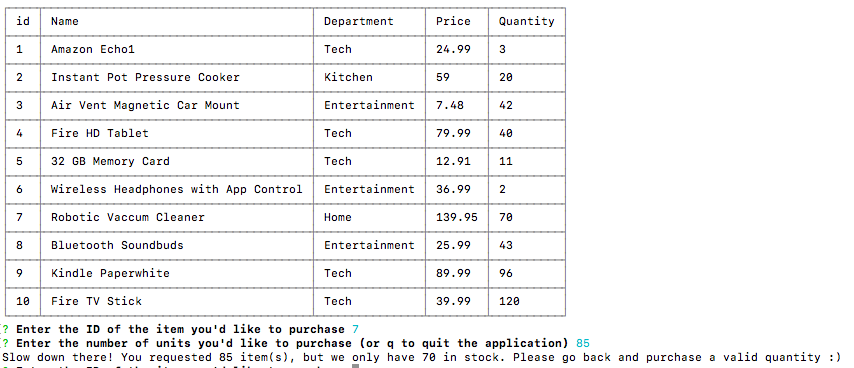
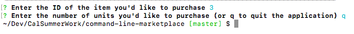
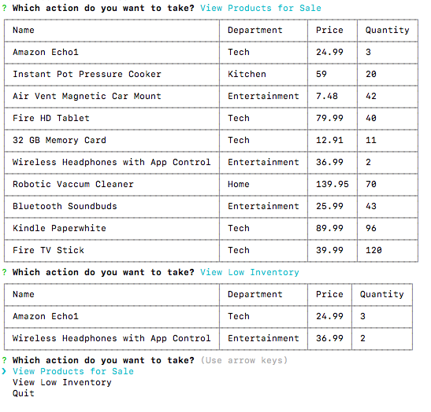

# command-line-marketplace
A command line application that emulates customer and manager interactions with inventory. 

## Project Description
App that displays inventory, allows users to make valid purchases, and gives managers ability to check on items that are dangerously low in stock

### Customer Application Workflow

The customer is presented with available items in the following format:

)

After entering the id and quantities of the item they'd like to purchase, your transaction is registered.

)

When the inventory is subsequently reloaded, it demonstrates updated quantities.

)

The user gets a warning if they try to purchase too much of an item

)

They can also quit the application by pressing the q button.

)

From a manager perspective, you can check on your entire inventory, or just items that are understocked (under 5)

)

#### Technologies Used
mysql, inquirer, node, cli-table2, javascript

 